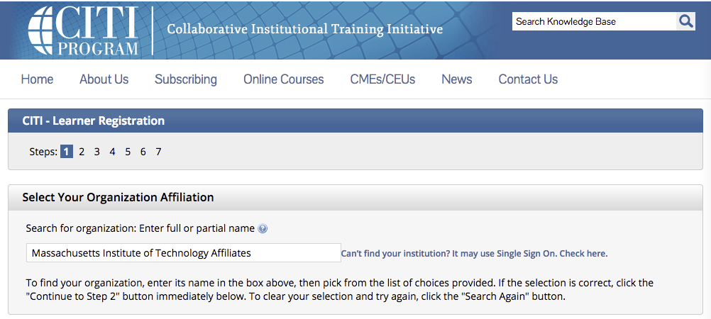
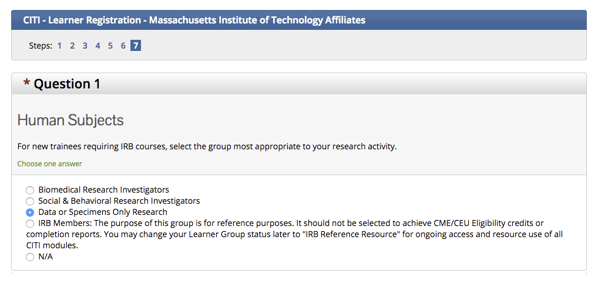
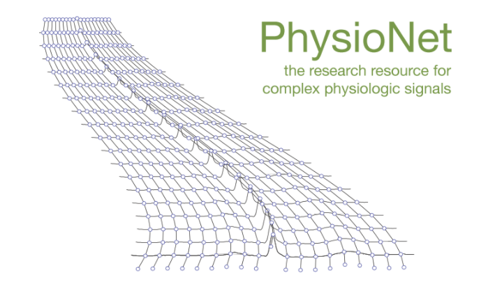

```{r setup, include=FALSE}
knitr::opts_chunk$set(echo = TRUE)
```

# Before attending the datathon

At least a week before the datathon, it is important that you request access to the MIMIC-III database by following the steps numbered below. The database, although de-identified, contains detailed information regarding the clinical care of patients, so it must be treated with appropriate care and respect.

## 1. Complete the required training course

Prior to requesting access to MIMIC, you will need to complete the CITI “Data or Specimens Only Research” course:

- First register on the CITI program website, selecting “Massachusetts Institute of Technology Affiliates” as your organization affilitation: https://www.citiprogram.org/index.cfm?pageID=154&icat=0&ac=0



- Follow the steps to add a Massachusetts Institute of Technology Affiliates course. In the Human Subjects category, select the “Data or Specimens Only Research” course.



- Complete the course and save a PDF copy of your certificate by clicking on the "My Reports" tab, then selecting the relevant "View/Print" link in the completion report column.  Your completion report should list all of the modules you completed for the course, with associated scores.

## 2. Request access to MIMIC-III:

- Create an account on PhysioNet using the following link: https://physionet.org/users/login.shtml



- Using your PhysioNet username and password, login to the MIMIC-III project with the following link: https://physionet.org/works/MIMICIIIClinicalDatabase/access.shtml.
- Read the Data Use Agreement. If you agree, click the "I agree" button and then follow the instructions for requesting access by email. You should include attach your CITI certificate and include the following details in your email:
    * General research area for which the data will be used: Critical care research for the London Datathon 2016.
    * Name of human studies training course completed: Collaborative Institutional Training Initiative (CITI Program)
    * Reference category: Supervisor
    * Reference's name: Leo Celi
    * Reference's telephone number: (617) 253-7937
    * Reference's email address: lceli@mit.edu
    * Reference's title: Instructor
- When your application has been approved you will receive emails containing instructions for downloading the database from the PhysioNet website. You will also be able to login to the querybuilder tool to explore the data: http://mimic.physionet.org/gettingstarted/querybuilder/. During the datathon, a cloud instance of MIMIC will be provided.
