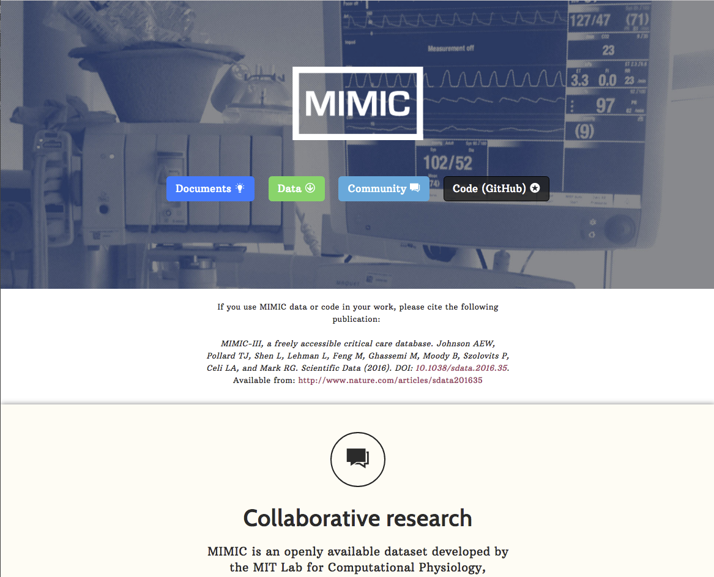
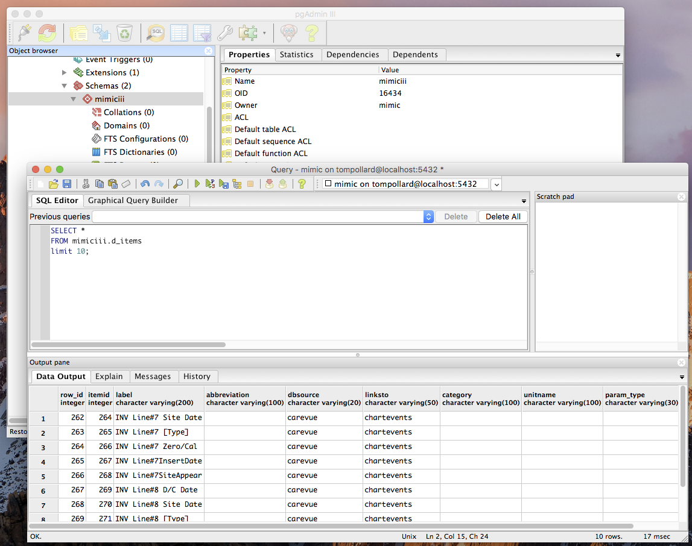
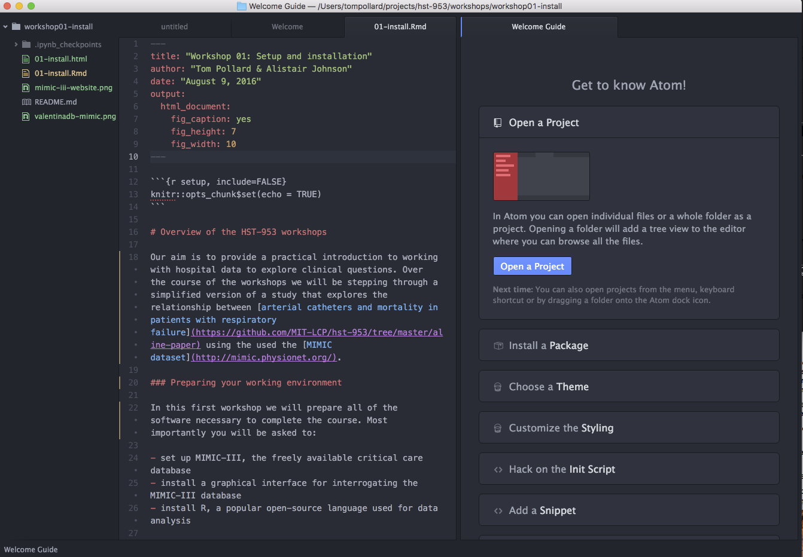

```{r setup, include=FALSE}
knitr::opts_chunk$set(echo = TRUE)
```

### Preparing your working environment

In this first workshop we will:

- set up a demo version of MIMIC-III, the freely available critical care database
- install R, a popular open-source language used for data analysis
- install additional tools

### Setting up the *demo* MIMIC-III database

[MIMIC-III](http://mimic.physionet.org/) is a clinical database developed by the MIT Laboratory for Computational Physiology, in collaboration with Beth Israel Deaconess Medical Center. The database includes information such as demographics, vital sign measurements made at the bedside (~1 data point per hour), laboratory test results, procedures, medications, caregiver notes, imaging reports, and mortality (both in and out of hospital).



MIMIC supports a diverse range of analytic studies spanning epidemiology, clinical decision-rule improvement, and electronic tool development. It is notable for three factors:

- it is freely available to researchers worldwide
- it encompasses a diverse and very large population of ICU patients
- it contains high temporal resolution data including lab results, electronic documentation, and bedside monitor trends and waveform.

*We will begin by installing a demo version of MIMIC-III, which includes data for a 100 patients and excludes the `noteevents` table.*

The following sections will guide you through the major steps in setting up your environment. We have also prepared operating system specific guides, which we recommend you open in a separate tab.

- [Instructions for Mac OS X](https://github.com/datascibc/datathon-2016/blob/master/02a-install-mac.md)
- [Instructions for Windows](https://github.com/datascibc/datathon-2016/blob/master/02b-install-windows.md)
- [Instructions for Linux (Ubuntu)](https://github.com/datascibc/datathon-2016/blob/master/02c-install-ubuntu.md)

#### 1. Installing PostgreSQL, a relational database system

MIMIC-III is a relational database, so requires the installation of a relational database system. In this workshop we will be using PostgreSQL. You may already have PostgreSQL installed. If not, please follow the instructions on the PostgreSQL website for download and installation:  https://www.postgresql.org/download/

#### 2. Installing a graphical tool for exploring MIMIC-III

While it is possible and often desirable to explore PostgreSQL databases using command line tools, we will be using a graphical tool in the workshops for simplicity. Please download and install PgAdmin3:

- PgAdmin3: https://www.pgadmin.org/download/



#### 3. Creating a local instance of the MIMIC-III demo in PostgreSQL

We will install a demo version of the MIMIC-III dataset available on [PhysioNet](https://physionet.org/). The demo includes data for 100 patients and excludes the `noteevents` table. To download the data you will need to complete the following steps:

- Sign up for an account on PhysioNet: https://physionet.org/pnw/login
- Login to PhysioNet and follow the instructions to download the PostgreSQL data file from: https://physionet.org/works/MIMICIIIClinicalDatabaseDemo/

Once the data has been downloaded, open PgAdmin3 and follow the steps below to load the data into your PostgreSQL database:

- connect to your database server (host: localhost; port 5432)
- create a new database named "mimiciii"
- right click on the database, choose 'Restore' and then select the demo file ('mimiciii_demo-postgres_9_5.backup')
- right click on the database again and select "Refresh". "mimiciii_demo" should now appear in your list of schemas.

### Installing R and RStudio

#### 1. Installing R

We will be analysing data with R, a popular open source language. To install R, follow the instructions on the following page: https://cran.rstudio.com/

#### 2. Installing RStudio

RStudio is a graphical interface for R. To install R Studio, follow the instructions at: https://www.rstudio.com/

#### 3. Installing required R packages

Part of the reason that R has become so popular is the vast number of packages that have been written to support research. We will be using the following packages during the course:

- ggplot2: for plotting
- RPostgreSQL: for connecting to a PostgreSQL database
- tableone: for describing baseline patient characteristics
- Hmisc: miscellaneous tools for data analytics
- dplyr : tools for manipulating data frame like objects
- devtools: a collection of package development tools
- caret : for creating predictive models (short for _C_lassification _A_nd _RE_gression _T_raining)
- rmarkdown: for outputting R Markdown documents into other formats
- knitr: for creating dynamic documents
- sjPlot: for data visualisation

You should install these packages by opening up RStudio and running the following command in the console for each of the packages:

```
install.packages("PACKAGENAME")
```

### Other tools

#### 1. Installing a text editor

Plain text editors are often helpful during data analysis, for example when writing code and when reviewing data.  You may already have a favourite text editor. If so, stick with that. If not try one of the following:

- Atom: https://atom.io/
- Notepad++: https://notepad-plus-plus.org/
- Sublime Text: https://www.sublimetext.com/



#### 2. Installing Git

Git is a powerful and increasingly popular version control system. We'll learn more about it during the course. To install Git, follow the instructions at: https://git-scm.com/book/en/v2/Getting-Started-Installing-Git (NB: Windows users should install "Git BASH")

#### 3. Creating an account on GitHub

Github is a website that interfaces with Git. It is useful for backing up and sharing code, and working collaboratively on research projects. If you don't already have an account, create one at: https://github.com/

### Reproducibility

We encourage everyone to take efforts to make work reproducible and highly recommend reading "[Good enough practices in scientific computing](https://arxiv.org/abs/1609.00037)" by Greg Wilson et al. 

### Finished!

If you've got to this point and all of the software above has been installed, then you are ready for the workshops. If you get stuck and need help, there are several facilitators on hand to help out.
