## Install Homebrew

Homebrew is a package management system for Mac OS X which makes installing software a lot easier. It requires a little bit of knowledge about using the command line, but the benefits are many, including a much simpler install process. Install brew by opening up a terminal (Applications -> Utilities -> Terminal). Then paste the following command:

```
/usr/bin/ruby -e "$(curl -fsSL https://raw.githubusercontent.com/Homebrew/install/master/install)"
```

Then, run the following:

```
brew install cask
```

If prompted to install the command line developer tools, click "Install" (note this may take some time).

## Install PostgreSQL

PostgreSQL is a relational database management system (RDMS) - software designed to facilitate querying of databases such as MIMIC-III. It should be included in Mac OS X, so try typing the following command in the terminal:

```
psql --version
```

If that prints out:

```
-bash: psql: command not found
```

... then run the following:

```
brew install postgresql
```

Now we will check that the services exists:

```
brew services list
```

You should see an output like:

```
Name        Status
postgresql  stopped
```

Now we will configure postgres. This configuration accomplishes two things: (i) it automatically runs the postgres service on login (so we can always connect to the database when we want), and (ii) ensure we always run the latest version of postgres that we have just installed.

First, create a LaunchAgents directory (if one doesn't exist):

```
mkdir -p ~/Library/LaunchAgents
```

Next, create a "link" which informs the computer where postgres is:

```
ln -sfv /usr/local/opt/postgresql/*.plist ~/Library/LaunchAgents
```

Finally, add this list to the default services that are started when Mac OS X boots:

```
launchctl load ~/Library/LaunchAgents/homebrew.mxcl.postgresql.plist
```

Now that postgres automatically starts with our computer, we'll also want to ensure that we prioritize this version of postgres over the one that ships with the Mac (which is usually out of date and possibly insecure). Type:

```
sudo nano /etc/paths
```

To bring up an editor window. You may need to type your password. If `/usr/local/bin` is on the first line, everything is perfect, and you can exit the editor using the hotkey `CTRL+X`. If `/usr/local/bin` is *not* on the first line, move it to the first line. Here's an example of a properly formatted file:

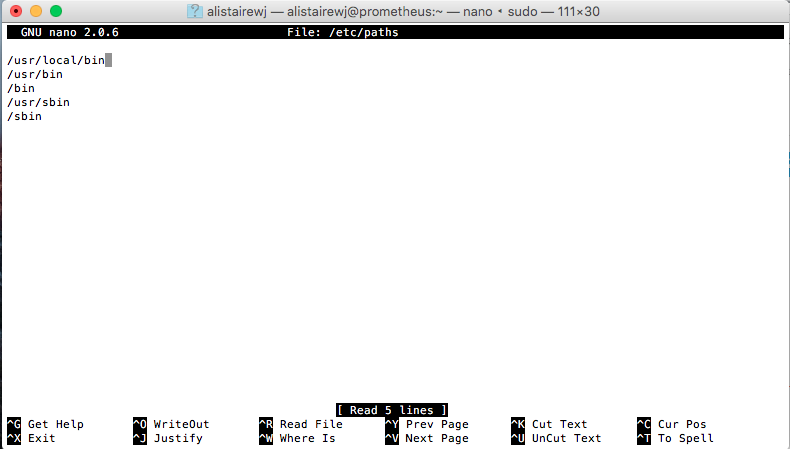

Once that's done, hit the hotkey `CTRL+O` (write out), followed by tapping the `ENTER` key. Then, exit the program by using `CTRL+X`.

Now that postgres is installed, let's install a graphical user interface for it. Type:

```
brew install Caskroom/cask/pgadmin3
```

Finally, once that is installed, reboot your machine. This is necessary both to finalize the configuration and to test everything is working. Once your machine has rebooted, confirm that the service started by typing:

```
brew services list
```

You should see something similar to `postgresql started`. If so, great! We will now initialize the database:

```
initdb -D /usr/local/var/postgres/data
```

Test that this installation worked by typing:

```
psql -d postgres
```

You should see something similar to:

```
psql (9.5.4)
Type "help" for help.

postgres=#
```

You can exit out of postgres by typing `\q`.
We'll need your username for the next section, so type:

```
whoami
```

And copy the answer.

## Install MIMIC on PostgreSQL

We will use a mini, demo version of MIMIC for the purposes of this installation workshop. While publicly accessible, the MIMIC-III demo is still considered sensitive data and you must agree to a limited data use agreement prior to downloading the data. This requires registering for a PhysioNetWorks account here: https://physionet.org/users/login.shtml

Once you have done that, follow the instructions on this page to download `mimiciii_demo-postgres_9_5.backup`: https://physionet.org/works/MIMICIIIClinicalDatabaseDemo/

We will restore the data from backup using pgadmin3 - a graphical user interface which allows access to MIMIC-III. Launch pgadmin3 either from the Applications folder (look for the elephant) or from the terminal (`pgadmin3`). You should see a window like this:

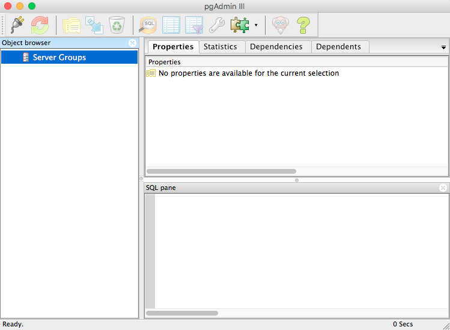

Click the icon that looks like an electrical plug (top left) - this will open a screen to connect to a new server. Fill in the following details, replacing <USERNAME> with your account username:

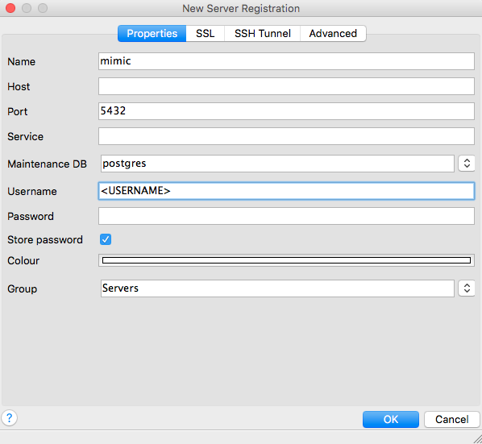

You should successfully connect to the database. If you look at the bottom of the window, there is a small amount of text which says "Connecting to the database... Done."

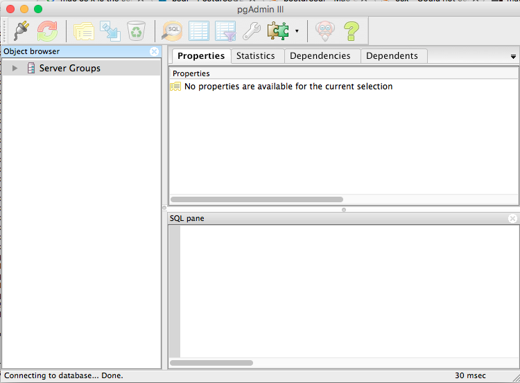

Expand the server list by clicking the sideways arrow next to "Server Groups", then the arrow next to "mimic". Hold down control, and click "Databases" -> "New Database...."

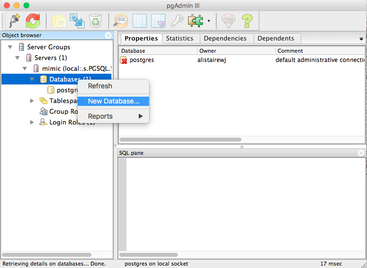

Fill in the details as below using your username instead of <USERNAME>:

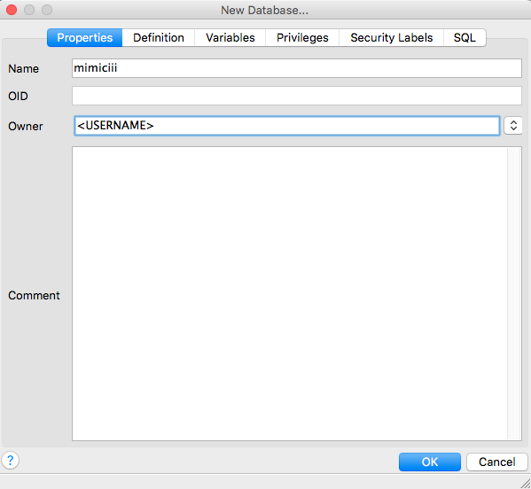

For example, my username was `alistairewj`, so I've filled that in here:

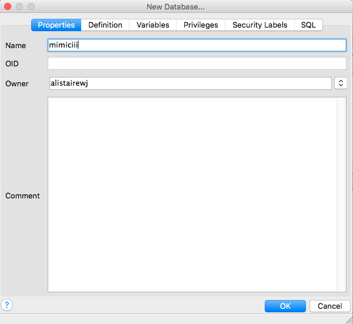

Click OK to create the database. You should see it appear now with a red "x" over the icon. Now, control click "mimiciii", and click "Restore..."

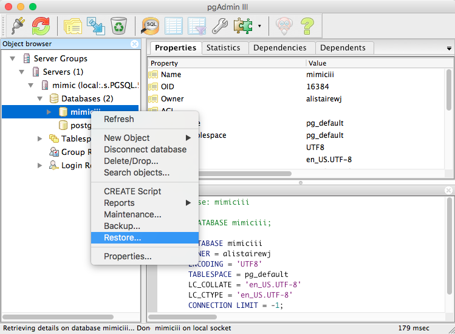

Click the three dots and navigate to the `mimiciii_demo-postgres_9_5.backup` file you've downloaded, usually in your Downloads folder. Here's an example of what mine looks like (my username is `alistairewj`, yours will differ):

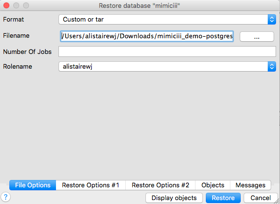

You don't have to worry about any of the options - just click "Restore". Once the restore has finished (the last line will read "Process terminated with exit code ..."), close out the dialog box. Control click mimic and click "Refresh". Then click the arrow next to "mimiciii", "Schemas", "mimiciii_demo", and finally "Tables". You should see a large number of tables such as "admissions", "callout", "caregivers", etc.

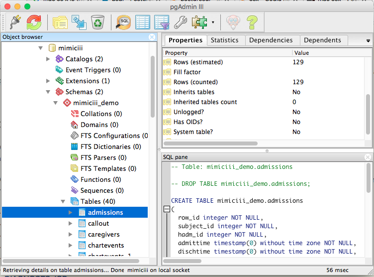

If your screen looks like the above, you have successfully installed the MIMIC-III demo!

## (Optional) Install another graphical tool for exploring MIMIC-III

You have already used pgAdmin3 - this is a particular "front end" software for exploring the data. However, it is not the only one. You can try DBeaver as an alternative, simply run:

```
brew install Caskroom/versions/dbeaver-community
```

You can also directly download the install files from http://dbeaver.jkiss.org/

Note that both DBeaver and PgAdmin3 connect to the same underlying database, so if you imported the data under PgAdmin3, you can still access it via DBeaver.

## Install R and RStudio

R is an open source software tool for data analysis which is used among many statisticians and data scientists. Again, easily installable through brew:

```
brew install homebrew/science/R
brew install Caskroom/cask/rstudio
```

<!-- NB: possibly need to R CMD javareconf JAVA_CPPFLAGS=-I/System/Library/Frameworks/JavaVM.framework/Headers -->

Alternatively, you can download R from: https://cran.rstudio.com and RStudio from: https://www.rstudio.com/products/rstudio/download3/

Let's open up RStudio. Go to your Applications and run "RStudio". You should be greeted by a screen like this:

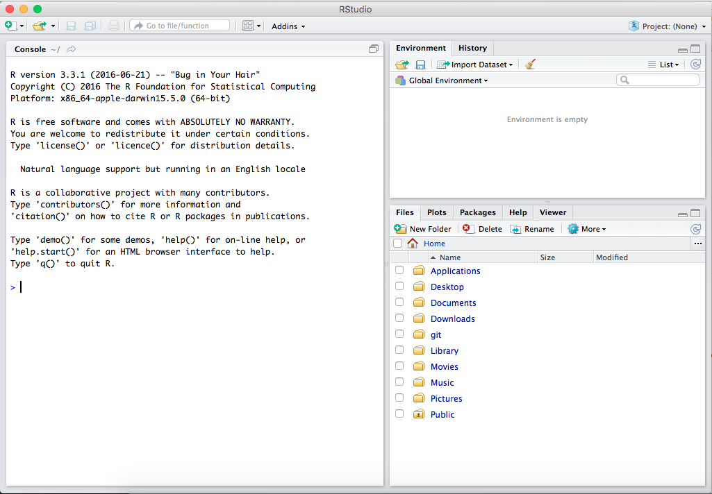

If you see something similar, you are in great shape. Now we will install various packages for R which we'll need for the course - these packages allow you to run useful analyses such as regressions, diagnostic tests, etc, all of which we will use later in the course. With RStudio open, you should see one of the sub-windows is called the "Console" - we'll be typing commands into this. Type the following:

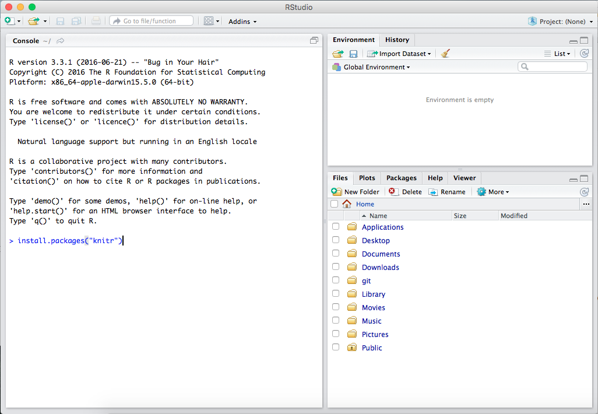

```R
install.packages("knitr")
```

The first time your un this command, you may be asked what mirror you would like to use. Most of them are fine, but **do not pick an https (secure) mirror**. This can bug out and there is little advantage to downloading these packages securely anyway.

The process will take a few minutes, and assuming all goes well, you should be greeted with the following message:

```
The downloaded source packages are in
    <path>
```

If so, great! Install the remaining packages by typing each line into the console, one line at a time:

```{R}
install.packages("RPostgreSQL")
install.packages("tableone")
install.packages("Hmisc")
install.packages("dplyr")
install.packages("devtools")
install.packages("caret")
install.packages("rmarkdown")
install.packages("ggplot2")
install.packages("sjPlot")
```

Note that these may take some time to download and compile.

## (Optional) Install a text editor

For the first few workshops, it will be convenient to have a text editor as we will not be using RStudio. We recommend using Atom as your text editor as it's free, open source, and integrates well with Git.

```
brew install Caskroom/cask/atom
```

You can also download Atom here: https://atom.io/

Other perfectly suitable options include:

* Notepad++: https://notepad-plus-plus.org
* Sublime Text: https://www.sublimetext.com

## (Optional) Install Git

We may use Git to download some software and scripts that we need.

```
brew install git
```

... or download it here (link immediately starts the download): https://git-scm.com/download/mac

Run through the install, keeping all the default settings.

## (Optional) Create GitHub account

GitHub is an online platform for hosting Git repositories with various useful extra features. Much of the code used throughout this course will be mirrored on GitHub. Create an account on GitHub now: https://github.com/
