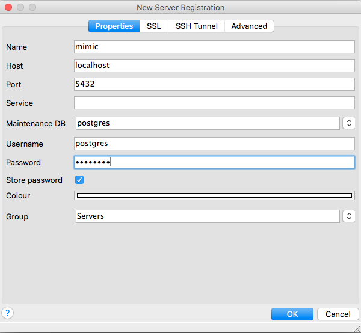

## Install PostgreSQL

PostgreSQL is a relational database management system (RDMS) - software designed to facilitate querying of databases such as MIMIC-III. Happily PostgreSQL distribute an installer for windows systems which you can find on their website: http://www.enterprisedb.com/products/pgdownload.do#windows

I recommend 9.5.4. Download the appropriate version for you (probably Windows x64), and run through the installer. The default values are fine for everything, except, when asked to type a password, we recommend using `postgres` - this will make the later installation stages easier. If you prefer to use a unique password, please **write down the password**, and don't use any password you commonly use on other websites.

You do not need to run "StackBuilder". We will acquire the necessary drivers later.

## Install MIMIC on PostgreSQL

We will use a mini, demo version of MIMIC for the purposes of this installation workshop. While publicly accessible, the MIMIC-III demo is still considered sensitive data and you must agree to a limited data use agreement prior to downloading the data. This requires registering for a PhysioNetWorks account here: https://physionet.org/users/login.shtml

Once you have done that, follow the instructions on this page to download `mimiciii_demo-postgres_9_5.backup`: https://physionet.org/works/MIMICIIIClinicalDatabaseDemo/

We will restore the data from backup using pgAdmin3 - a graphical user interface which allows access to MIMIC-III. Happily, it was installed alongside PostgreSQL. Launch pgAdmin3 from your start menu (you can type in the name pgadmin3, look for the elephant). You should see a window like this:


Click the icon that looks like an electrical plug (top left) - this will open a screen to connect to a new server. Fill in the following details, using the password (usually `postgres`).



You should successfully connect to the database. If you look at the bottom of the window, there is a small amount of text which says "Connecting to the database... Done."


Expand the server list by clicking the sideways arrow next to "Server Groups", then the arrow next to "mimic". Right click "Databases" -> "New Database...."


Fill in the details as below using your username instead of <USERNAME>:


For example, my username was `alistairewj`, so I've filled that in here:


Click OK to create the database. You should see it appear now with a red "x" over the icon. Now, right click "mimiciii", and click "Restore..."


Click the three dots and navigate to the `mimiciii_demo-postgres_9_5.backup` file you've downloaded, usually in your Downloads folder. Here's an example of what mine looks like (my username is `alistairewj`, yours will differ):


You don't have to worry about any of the options - just click "Restore". Once the restore has finished (the last line will read "Process terminated with exit code ..."), close out the dialog box. Right click mimic and click "Refresh". Then click the arrow next to "mimiciii", "Schemas", "mimiciii_demo", and finally "Tables". You should see a large number of tables such as "admissions", "callout", "caregivers", etc.


If your screen looks like the above, you have successfully installed the MIMIC-III demo!

## (Optional) Install a graphical tool for exploring MIMIC-III

You have already used pgAdmin3 - this is a particular "front end" software for exploring the data. However, it is not the only one. You can try DBeaver as an alternative: http://dbeaver.jkiss.org/

Note that both DBeaver and PgAdmin3 connect to the same underlying database, so if you imported the data under PgAdmin3, you can still access it via DBeaver.

## Install R and RStudio

R is an open source software tool for data analysis which is used among many statisticians and data scientists. To download it, go to https://cran.rstudio.com
Click "Download R for Windows" - then click "base" - then "Download R 3.3.1 for Windows". Run through the installer to completion.

Next, we will install a graphical interface for R called RStudio. Download "RStudio Desktop" from: https://www.rstudio.com/products/rstudio/download3/

Run through the installation (again keeping all the defaults).

Start RStudio. You should end up with a screen similar to the following:


If you see something similar, you are in great shape. Now we will install various packages for R which we'll need for the course - these packages allow you to run useful analyses such as regressions, diagnostic tests, etc, all of which we will use later in the course. With RStudio open, you should see one of the sub-windows is called the "Console" - we'll be typing commands into this. Type the following:


```R
install.packages("knitr")
```

The first time your un this command, you may be asked what mirror you would like to use. Most of them are fine, but **do not pick an https (secure) mirror**. This can bug out and there is little advantage to downloading these packages securely anyway.

If the above worked, you should be greeted with the following message:

```
The downloaded binary packages are in
        <path>
```

If so, great! Install the remaining packages by typing each line into the console, one line at a time:

```R
install.packages("RPostgreSQL")
install.packages("tableone")
install.packages("Hmisc")
install.packages("dplyr")
install.packages("devtools")
install.packages("caret")
install.packages("rmarkdown")
install.packages("ggplot2")
install.packages("sjPlot")
```

## (Optional) Install a text editor

For the first few workshops, it will be convenient to have a text editor as we will not be using RStudio. We recommend using Atom as your text editor as it's free, open source, and integrates well with Git. You can download Atom here: https://atom.io/

Other perfectly suitable options include:

* Notepad++: https://notepad-plus-plus.org
* Sublime Text: https://www.sublimetext.com

## (Optional) Install Git

We may use Git to download some software and scripts that we need. Git is a version control system which facilitates collaboration in developing projects. Download it here (link immediately starts the download): https://git-scm.com/download/win

Run through the install, keeping all the default settings.

## (Optional) Create GitHub account

GitHub is an online platform for hosting Git repositories with various useful extra features. Much of the code used throughout this course will be mirrored on GitHub. Create an account on GitHub now: https://github.com/
